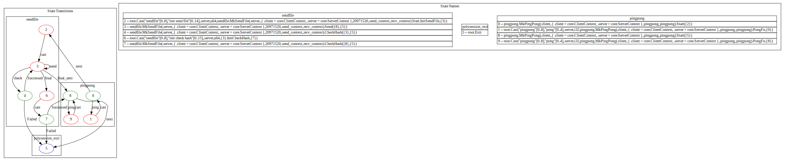

A multi-role communication protocol framework that is ahead of its time.

## Examples: Combining the sendfile protocol with the pingpong protocol

```zig
pub const EnterFsmState = PingPong.Start(SendFile.Start(PingPong.Start(ps.Exit), ps.Exit));
```
