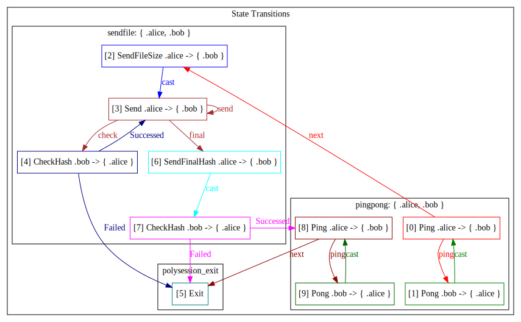

A multi-role communication protocol framework.

# Examples
## pingpong
```shell
zig build pingpong
```
Alice and Bob have multiple ping-pong communications back and forth.


## sendfile

```shell
zig build sendfile
```
Alice sends a file to Bob, and every time she sends a chunk of data, she checks whether the hash values of the sent and received data match.


## pingpong-sendfile

```shell
zig build pingpong-sendfile
```
Combining the pingpong protocol and the sendfile protocol


## 2pc

```shell
zig build 2pc
```
A two-phase protocol demo with Charlie as the coordinator and Alice and Bob as participants.
Alice and Bob have no actual transactions; they simply randomly return true or false.


## random-pingpong-2pc

```shell
zig build random-pingpong-2pc
```
A complex protocol involving four actors has an additional selector to select the combined protocol to run.
Here, we arbitrarily combine the pingpong protocol and the 2pc protocol.
Note that the communication actors in pingpong and 2pc are different.
Polysession supports this combination of different protocols, even if the protocols have different numbers of participants.


